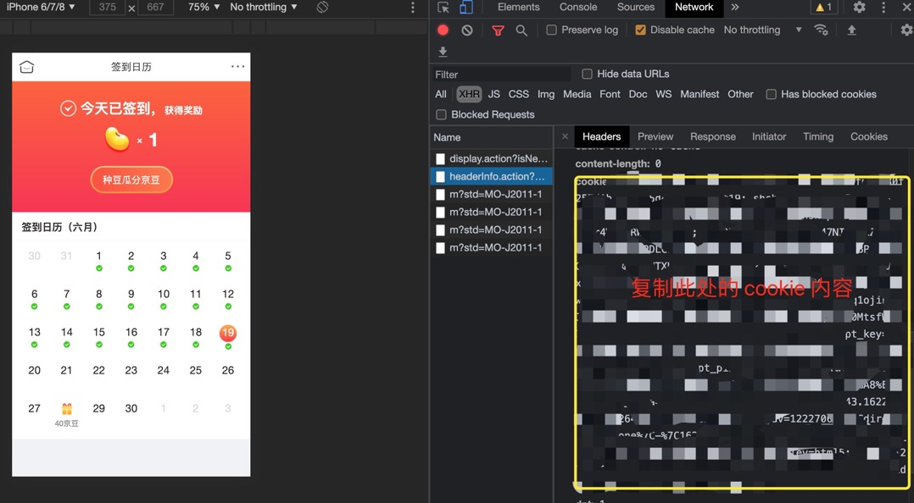
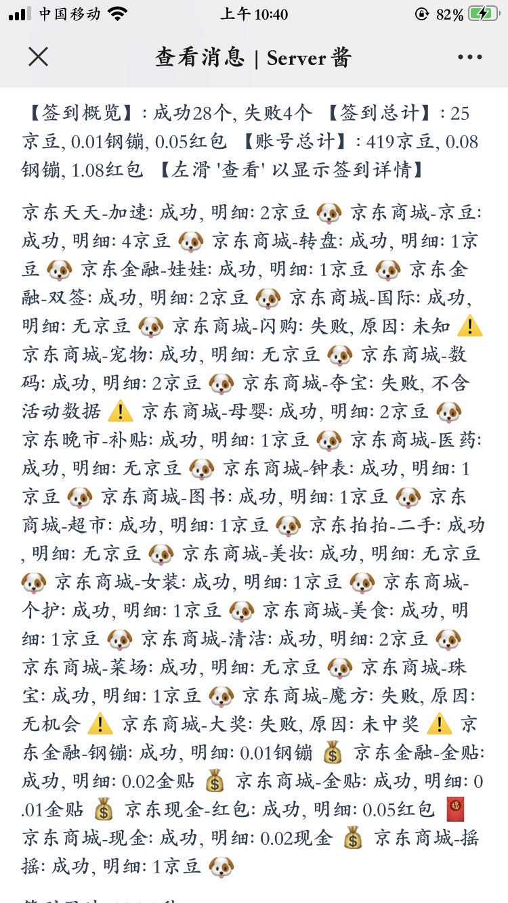

# 基于github action的京东自动化签到

## 介绍

> 使用NobyDa “京东多合一签到脚本”为基础，移植到github actions自动化执行。

## 触发方式

1. 点亮`Star`
2. 凌晨4点定时执行
3. 自定义：`.github/workflows/active-jd-sign.yaml` 编辑

## 使用用法

* 点击右上角 `Fork` 项目；
* `Settings` -> `Secrets` 中添加京东cookie、Server酱SCKEY
	- `JD_COOKIE`：账号1Cookie
	- `JD_COOKIE2`：账号2Cookie(选填)
	- `PUSH_KEY`：Server酱SCKEY
* 点击`Star`，任务会自动执行，运行进度和结果可以在`Actions`页面查看；
* 当任务运行完成时，会将运行结果和错误信息打包到`Artifacts`，可自行下载查看；

## 获取京东cookie

1. 点击[领京豆](https://bean.m.jd.com/)登陆；
2. 在[领京豆](https://bean.m.jd.com/)页面登陆后，按 `F12` 打开开发者模式
3. 点击控制台 (`network`) 复制下面 cookie

## 获取Server酱SCKEY

* github 授权登录[Server酱](http://sc.ftqq.com/3.version)官网；
* 菜单栏`微信推送`扫描绑定微信；
* 菜单栏`发送消息`拷贝SCKEY；

## 效果截图

## 参考项目
* [NobyDa/Script/JD-DailyBonus](https://github.com/NobyDa/Script/blob/master/JD-DailyBonus/JD_DailyBonus.js)
